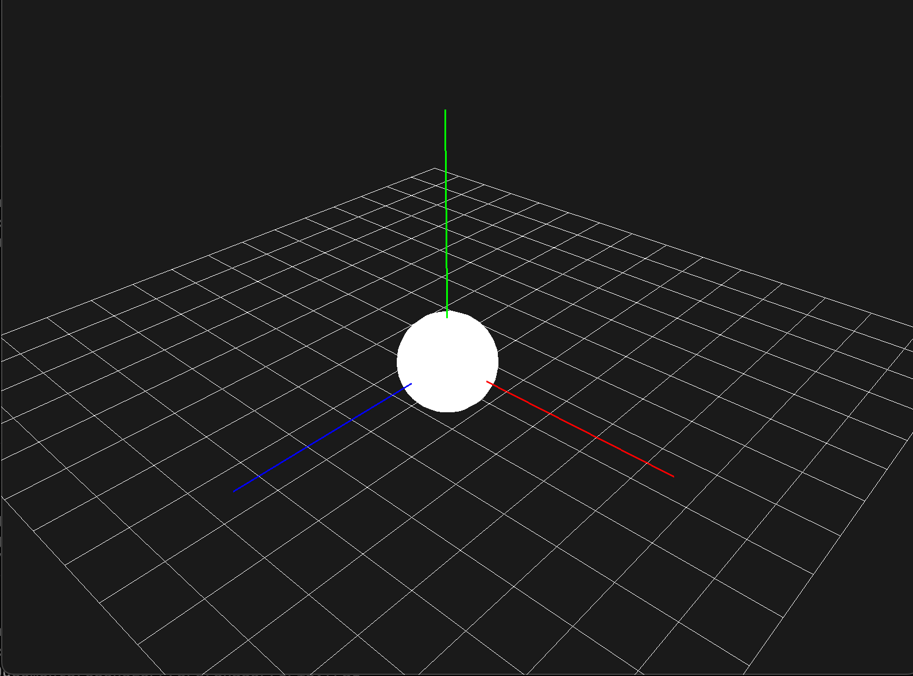

# OpenGLCPP



## Description
OpenGLCPP est un projet éducatif conçu pour apprendre les bases du C++ et de l'OpenGL. L'objectif principal est de construire un simulateur physique simple, intégrant des concepts tels que les collisions et la gravité, tout en explorant les possibilités graphiques offertes par OpenGL.

Ce projet n'est pas destiné à être une solution optimisée ou avancée pour la simulation physique. Il vise plutôt à fournir une plateforme ludique et éducative pour expérimenter avec le C++ et OpenGL, permettant de réaliser divers tests et expériences.

## Fonctionnalités
- **Simulation de base de la physique** : Prise en charge de concepts élémentaires tels que la gravité et les collisions.
- **Rendu graphique** : Utilisation d'OpenGL pour le rendu de formes simples comme des cubes et des sphères.
- **Interaction utilisateur** : Contrôle de la caméra et interaction avec les objets via le clavier et la souris.

## Structure du Projet
Le projet est organisé comme suit :
```
OpenGLCPP
├── Makefile
├── README.md
├── build
│   ├── [Fichiers .o et exécutable]
├── include
└── src
    ├── Camera.cpp
    ├── Camera.h
    ├── Renderer.cpp
    ├── Renderer.h
    ├── Shader
    │   ├── grid.frag
    │   └── grid.vert
    ├── Shader.cpp
    ├── Shader.h
    └── main.cpp
```

## Installation et Compilation
1. **Dépendances** : Assurez-vous que les bibliothèques `GLFW`, `GLEW` et `glm` sont installées sur votre système.
2. **Compilation** : Utilisez le `Makefile` fourni pour compiler le projet. Exécutez `make` dans le répertoire racine du projet.
3. **Exécution** : Après la compilation, exécutez l'application depuis le répertoire `build`.

## Utilisation
- **Contrôle de la Caméra** :
  - `Z/S/A/D` pour déplacer la caméra.
  - `K/L` pour monter ou descendre.
  - `R` pour activer/désactiver la rotation automatique de la caméra.
  - `Espace` pour augmenter la vitesse de la caméra.
- **Interaction** :
  - Utilisez la souris pour orienter la caméra.
  - Échappe (`Esc`) pour quitter l'application.

## Contributions
Les contributions sont les bienvenues, surtout pour améliorer la simulation physique et ajouter de nouvelles fonctionnalités.

## Auteur
[SirWolf]
[Moussacodes]
